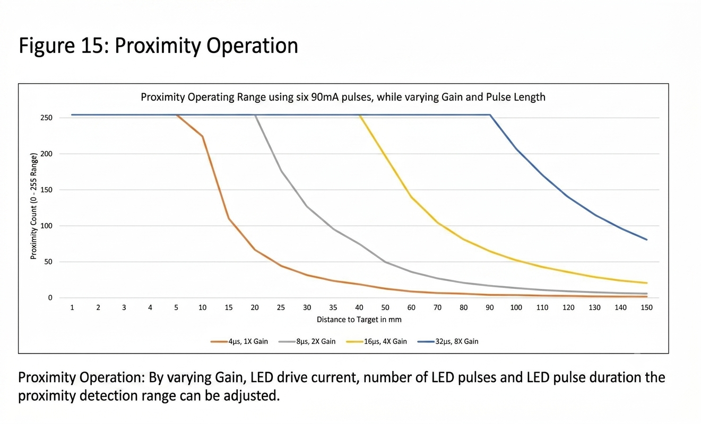

# Linux Userspace Drajver za senzor TMD37253
## Uvod
Ovaj projekat implementira uređaj za detekciju blizine, mjerenje osvijetljenosti i hromatskog spektra okruženja.  
Korišten je senzor blizine, boje (RGBC+IR) i ambijentalnog osvjetljenja *TMD37253* integrisan na razvojnu pločicu *Light mix-sens Click*.  
Linux *Userspace* drajver koji je razvijen da ispuni zahtjeve projekta je testiran na *DE1-SoC* razvojnoj ploči na kojoj je pokrenut embedded Linux sistem izgrađen pomoću *Buildroot* alata.

## Buildroot
Sistem koji smo izgradili u toku kursa Ugrađeni Računarski Sistemi je potrebno minimalno modifikovati za omogućavanje testiranja ovog projekta.  
Ukratko ono što smo imali do sada:

- *Buildroot 2024.02*
- Linux kernel *socfpga-6.1.38-lts*
- Bootloader *U-Boot 2024.01*
  
Defaultna konfiguracija u okviru *Buildroot* za našu *DE1-SoC* razvojnu ploču se nalazi u *buildroot/configs/terasic_de1soc_cyclone5_defconfig*.  
Defaultna konfiguracija za Linux kernel našeg sistema se nalazi u *buildroot/board/terasic/de1soc_cyclone5/de1_soc_defconfig*.  
Defaultna konfiguracija za *U-Boot* bootloader *socfpga_de1_soc* se učitava iz izvornog stabla *U-Boot* *(In-tree board defconfig file)*.  

Napravljen je *rootfs overlay* u koji je smješten fajl *buildroot/board/terasic/de1soc_cyclone5/rootfs-overlay/etc/systemd/network/70-static.network* koji omogućava da *systemd* infrastruktura ispravno konfiguriše mrežni interfejs.  
Dodat je *Dropbear* sofverski paket za omogućenje pristupa ploči preko *SSH* protokola, te zatim u *rootfs overlay* smješten javni ključ generisan pomoću *ssh-keygen* alata u fajl *buildroot/board/terasic/de1soc_cyclone5/rootfs-overlay/root/.ssh/authorized_keys*.  
### Toolchain
Korišćen je alat *Crosstool-NG* za generisanje toolchain-a, odabrana je početna konfiguracija *arm-cortexa9_neon-linux-gnueabihf* a zatim odabrane sledeće opcije:
```
Languages       : C,C++
OS              : linux-6.1.35
Binutils        : binutils-2.40
Compiler        : gcc-13.2.0
C library       : glibc-2.38
Debug tools     : gdb-13.2
Companion libs  : expat-2.5.0 gettext-0.21 gmp-6.2.1 isl-0.26 libiconv-1.16 mpc-1.2.1 mpfr-4.2.1 ncurses-6.4 zlib-1.2.13 zstd-1.5.5
Companion tools :
```
Ovaj toolchain je dodat kao eksterni u Buildroot sistem sa apsolutnom putanjom prema istom(za reprodukciju build-a potrebno prilagoditi).
 
### Modifikacije
Da bismo mogli da koristimo I2C periferiju, koja nam je potrebna za komunikaciju sa senzorom, potrebno je da eksportujemo signale HPS periferija (među kojima je i I2C2) preko *FPGA Interconnect* prema FPGA dijelu *Cyclone V SoC* a zatim kroz FPGA Fabric povežemo ove signale na pinove GPIO konektora.    

Ovo se postiže tako što se prilagodi konfiguracija SPL-a i U-Boot primjenom patch-a *(de1-soc-handoff.patch)* koji se na repozitorijumu nalazi u 
*buildroot/board/terasic/de1soc_cyclone5/patches/uboot/* direktorijumu. Ovo se u Buildroot-u automatizuje na sledeći način:
```
make menuconfig
```
A zatim u meniju za modifikovanje Buildroot konfiguracije potrebno je postaviti: 
```text
Bootloaders
└── [*] U-Boot
    └── (board/terasic/de1soc_cyclone5/patches/uboot) Custom U-Boot patches
```
Fajl *buildroot/board/terasic/de1soc_cyclone5/boot-env.txt* za *U-Boot* okruženje je prilagođen da bi se uzele u obzir promjene.  
*U-Boot* za programiranje FPGA prema izmjenama treba da ima pristup konfiguracionom fajlu *socfpga.rbf*, ovaj fajl je potrebno 
kopirati na FAT32 particiju na SD kartici prije pokretanja sistema. 
Da bismo izbjegli ručno kopiranje ovo se takođe može automatizovati u okviru *Buildroot* na sledeći način:
```text
System configuration
└── (board/terasic/de1soc_cyclone5/post-image.sh support/scripts/genimage.sh) Custom scripts to run after creating filesystem images
```
Ovime dodajemo skriptu *post-image.sh* koja treba da se nalazi prije *genimage.sh* da bi to bio redoslijed izvršavanja.
Ovde *post-image.sh* vrši kopiranje *socfpga.rbf* u *output/images* , a zatim ga skripta *genimage.sh* kopira direktno u *sdcard.img* na FAT32 particiju.
Za ovu funkcionalnost je još samo potrebno modifikovati *genimage.cfg*:
```
image boot.vfat {
	vfat {
		files = {
			"zImage",
			"socfpga_cyclone5_de1_soc.dtb",
			"socfpga.rbf"
		}
	}
 size = 16M
}
```
tako da dodamo naš konfiguracioni fajl i povećamo veličinu *boot.vfat*.


Naš Userspace drajver je implementiran kao paket u okviru eksternog *Buildroot* stabla, ovo olakšava nadogradnju *Buildroot*-a na novu verziju kao i prenos projekta na drugi sistem, jer nije potrebno dodavanje paketa u samo *Buildroot* stablo.  
Da bismo ga dodali u postojeću infrastrukturu potrebno je prvo uopšte registrovati ovo eksterno stablo:
```
make BR2_EXTERNAL=path-to/tmd3725-br-external menuconfig  #if no previously existing external tree
```
A zatim uključiti: 
```text
External options
└── External Buildroot tree for the TMD3725 color sensor (RGBC+IR),ambient light and proximity sensor
    └── [*] tmd3725-userspace-driver
```
i pokrenuti *make* za build, ovo će nam generisati aplikaciju i konfiguracioni fajl */usr/bin/tmd3725_sensor* i */etc/tmd3725.conf*  

Ukoliko se prave modifikacije našeg userspace drajvera onda radimo:
```
make tmd3725-userspace-driver-rebuild
make
```
Ukoliko želimo da ga uklonimo radimo:
```
make BR2_EXTERNAL="" menuconfig
make clean
```
ili
```
make BR2_EXTERNAL="" menuconfig
make tmd3725-userspace-driver-dirclean # removes output/build/tmd3725-userspace-driver/
rm output/target/usr/bin/tmd3725_sensor
rm output/target/etc/tmd3725.conf
```
gdje moramo da ručno uklonimo fajlove iz *output/target* jer Buildroot radi inkrementalan build i neće ih ukloniti pri sledećem *make*.  
Više o funkcionalnosti eksternog stabla u *Buildroot*-u: [External tree Buildroot](https://buildroot.org/downloads/manual/manual.html#outside-br-custom)

## Postupak Mjerenja

Jedan integracioni ciklus senzora se sastoji od 3 odvojena dijela(stanja) koji se, ukoliko su uključeni, uvijek izvršavaju u istom rasporedu:

**ALS -> Proximity -> Wait Timer**

Oni se uključuju/isključuju odvojeno upisivanjem u registre *AEN/PEN/WEN*, dok se vrijeme trajanja svakog dijela podešava u registrima *ATIME/PRATE/WTIME*.  
Uključivanje/isključivanje internog oscilatora senzora i *ADC(Analog to Digital Converter)* kanala se radi upisivanjem u registar *PON*, upisivanjem visokog nivoa budimo senzor iz *sleep*-a i praktično započinjemo mjerenje(ukoliko su *AEN* ili *PEN* ili oba uključeni).

*ALS(Ambient Light Sensing)* mjerenje funkcioniše tako što RGBC fotodiode apsorbuju fotone svjetlosti u opsegu talasnih dužina koji odgovara datom kanalu (svaka fotodioda ima optički filter koji propušta samo određeni dio spektra). Struje generisane na fotodiodima se akumuliraju na odvojenim ADC kanalima(četiri odvojena ADC kanala za svaku fotodiodu) za vrijeme trajanja *ATIME*, na kraju dobijamo 16 bitne vrijednosti za svaki kanal koje predstavljaju *digital counts* vrijednosti za taj opseg: 
- *CDATAL/CDATAH - Clear channel data low byte/high byte*   
- *RDATAL/RDATAH - Red channel data low byte/high byte*  
- *GDATAL/GDATAH - Green channel data low byte/high byte*  
- *BDATAL/BDATAH - Blue channel data low byte/high byte*

*Proximity* mjerenje se odnosi na detekciju blizine objekta senzoru, implementirano je pomoću jedne *IR* fotodiode(prijemnik) i jedne *IR LED* diode(emiter), i izvršava se u sledećim koracima:  
- *IR* fotodioda mjeri *IR* sadržaj ambijentalne svjetlosti dok je *IR LED* ugašena.
- *LED IR* emituje signal prema objektu i on se odbija nazad na *IR* fotodiodu.
- Rezultat u prvom koraku(kada *LED IR* nije upaljena) se oduzima od rezultata u drugom koraku tako da dobijemo čisto vrijednost odbijenog signala od objekta.
- Vrijednosti se akumuliraju preko *Prox ADC*, konačna vrijednost se upisuje u 8 bitni registar *PDATA*.

*Wait Timer* predstavlja vremensku pauzu između integracionih ciklusa, u ovom stanju senzor ne vrši mjerenja ali interni oscilator ostaje uključen.

Nakon završetka *ALS/Proximity* mjerenja postavlja se *AINT/PINT* bit u *STATUS* registru u zavisnosti od toga kako je podešena vrijednost registra perzistencije
*PERS(APERS/PPERS)* [TMD3725 datasheet - PERS Register](https://look.ams-osram.com/m/6a4d0816b7d3a4bf/original/TMD3725-ALS-Color-and-Proximity-Sensor-Module.pdf#page=25) na sledeći način: 

*APERS/PPERS* = 0 - *AINT/PINT* se postavljaju u svakom ciklusu nezavisno od vrijednosti svakog od mjerenja  
*APERS/PPERS* = 1 - *AINT/PINT* se postavljaju ukoliko vrijednost *ALS/Proximity* mjerenja nije u opsegu postavljenih granica  
*APERS/PPERS* = 2 - *AINT/PINT* se postavljaju ukoliko vrijednost *ALS/Proximity* mjerenja nije u opsegu postavljenih granica za 2 uzastopna mjerenja  
....  
*APERS/PPERS* = 15 - *AINT* se postavlja za 60 uzastopnih *ALS* mjerenja van granica, *PINT* se postavlja za 15 uzastopnih *Proximity* mjerenja van granica  

Granice za dozvoljene opsege vrijednosti se postavljaju u registrima:  
*PILT/PIHT* - Donja/Gornja granica za vrijednost *Proximity* mjerenja, *PDATA* vrijednost van ovog opsega može da izazove postavljanje *PINT* u zavisnosti od *PPERS* vrijednosti.    
*AILTL/AILTH* - Donja granica za vrijednost *Clear channel count*, vrijednost *CDATAL/CDATAH* ispod ove granice može da izazove postavljanje *AINT* u zavisnosti od *APERS* vrijednosti.    
*AIHTL/AIHTH* - Gornja granica za vrijednost *Clear channel count*, vrijednost *CDATAL/CDATAH* iznad ove granice može da izazove postavljanje *AINT* u zavisnosti od *APERS* vrijednosti.    

*AIEN/PIEN* bit u *INTENAB* registru([TMD3725 datasheet - INTENAB registar](https://look.ams-osram.com/m/6a4d0816b7d3a4bf/original/TMD3725-ALS-Color-and-Proximity-Sensor-Module.pdf#page=41)) postavlja da li će se *AINT/PINT* proslijediti na *INT* hardverski interrupt pin senzora:  
*AIEN* = 1 - Ukoliko je *AINT* = 1 tj. ukoliko je postavljen, tada će se postaviti *INT* hardverski interrupt  
*PIEN* = 1 - Ukoliko je *PINT* = 1 tj. ukoliko je postavljen, tada će se postaviti *INT* hardverski interrupt  
Dodatno *INT* mogu da postave *PSIEN(Proximity Saturation Interrupt)*, *ASIEN(ALS Saturation Interrupt)*, *CIEN(Calibration Interrupt)* ukoliko su postavljeni. 
*INT* na ovom senzoru je implementiran kao open-drain active low.  

Opcija *SAI*(*Sleep After Interrupt*) kada je omogućena stavlja senzor u *sleep* stanje tj. gasi oscilator senzora kada je hardverski interrupt pin *INT* postavljen(tj. kada je spušten na masu). Senzor ostaje u ovom stanju (efektivno *PON* = 0) sve dok se u *STATUS* registru ne očisti bit koji je postavljen *(PINT/AINT/CINT/ASAT/PSAT)*.

Opcija *INT_READ_CLEAR* kada je omogućena nakon čitanja *STATUS* registra odmah očisti postavljene bite u istom(*STATUS* registar je *R, SC(self-clear)*), te na ovaj način možemo da uštedimo na ručnom upisu u *STATUS*.

Tipično način na koji bi radili jeste da postavimo granice za vrijednosti mjerenja kada želimo da se postavi *PINT/AINT* i sa kakvom perzistencijom. 
Zatim bi omogućili *AIEN/PIEN/SAI/INT_READ_CLEAR* tako da kada se postavi hardverski interrupt *INT* zbog omogućenog *SAI* oscilator se gasi i vrijednosti mjerenja se nalaze u registrima sve dok ne pročitamo *STATUS* registar, nakon toga se *STATUS* registar zbog omogućenog INT_READ_CLEAR automatski čisti i senzor započinje novi integracioni ciklus.  

Mi ćemo za prikaz funkcionalnosti ovog senzora raditi sa oba mjerenja u svakom integracionom ciklusu (AEN/PEN = 1), bez postavljenih granica ili perzistencije za vrijednosti mjerenja, tako da jednostavno u svakom ciklusu čitamo obe vrijednosti mjerenja.  
S obzirom da su ova dva mjerenja sekvencijalna a ne paralelna praktično nam je najlakše da kao uslov završenog ciklusa jednostavno uzmemo da su oba mjerenja završena istovremeno, ovo znači da možemo da očekujemo nove vrijednosti npr. po default ATIME(~178ms) + 4*PRATE(~2.8ms) svakih ~200ms.  
Ovde sada imamo deterministično postavljanje *PINT/AINT* nakon završetka svakog integracionog ciklusa. Prema tome sasvim je adekvatno da jednostavno koristimo
*polling* pristup umjesto userspace pristup GPIO prekidu(*event driven* pristup preko *sysfs* ili *libgpiod*).

Vrijednosti mjerenja ostaju u registrima sve dok se u narednom integracionom ciklusu to isto mjerenje ne završi i upiše nove vrijednosti.
Mi ćemo raditi periodičan *polling* sa uslovom da su oba mjerenja(Proximity i ALS) završena u tom ciklusu i nakon toga ručno čistiti *STATUS* registar pri čemu senzor nastavlja regularno sa radom bez obzira na vrijednosti u *STATUS*.

Pošto naš uslov zahtijeva da su oba flag-a (*AINT* i *PINT*) već postavljena da bi se *poll* smatrao uspješnim, prvi trenutak kada taj uslov uopšte može biti tačan je tek nakon što Proximity mjerenje završi. Od tog trenutka pa do završetka ALS mjerenja u sledećem ciklusu podaci u registrima ostaju iz istog ciklusa,
prema tome treba da biramo vrijeme *polling*-a:  
```text
POLL_TIME_US_ms + I2C_CYCLE_WORST_CASE_TIME_ms < ATIME_ms_min + WTIME_ms_min 
```
jer nam ovaj uslov omogućava da ALS i Proximity rezultati mjerenja budu iz istog integracionog ciklusa.  
Prilikom odabira vrijednosti *POLL_TIME_US* potrebno je uzeti u obzir da korak za *ATIME/WTIME* može da se nalazi u sledećem opsegu:  
*Integration time step size(2.68 - 2.90) ms Typical value 2.78ms*  i mi treba da koristimo minimalnu vrijednost *2.68ms* pri proračunu.  

Vrijednosti *POLL_TIME_US, ATIME, WTIME* mogu da se modifikuju u okviru konfiguracionog fajla */etc/tmd3725.conf* pri čemu treba obratiti pažnju na to da logika koja čita i parsira konfiguraciju (*main.c:load_configuration()*) ne vrši bilo kakvu provjeru smislenosti/validnosti unesenih parametara.

*INT_READ_CLEAR* ovde nećemo koristiti jer bi ovo potencijalno značilo da bi *polling* za vrijeme *proximity* mjerenja, dok još nije završeno, očistio *AINT*
koji je postavljen nakon završetka *ALS* mjerenja pri čemu naš uslov završenog ciklusa (ALS i Proximity oba završena) nije zadovoljen, umjesto toga ćemo ručno čistiti *STATUS* registar.

Dijagram mašine stanja senzora:[TMD3725 datasheet - State Diagram](https://look.ams-osram.com/m/6a4d0816b7d3a4bf/original/TMD3725-ALS-Color-and-Proximity-Sensor-Module.pdf#page=16) 

## I2C Komunikacija

U *datasheet*-u senzora možemo da pronađemo sledeću strukturu za I2C upise/čitanja:     
*A Write transaction consists of a START, CHIP-ADDRESS-WRITE, REGISTER-ADDRESS, DATA BYTE(S), and STOP.*  
*A Read transaction consists of a START, CHIP-ADDRESS-WRITE, REGISTER-ADDRESS, START, CHIP-ADDRESS-READ, DATA BYTE(S), and STOP.*   

Ovo ćemo implementirati pomoću *ioctl* sistemskog poziva sa *I2C_RDWR* flegom.    
*Read* transakciju implementiramo sa 2 *i2c_msg* poruke, gdje prva upisuje adresu registra iz kojeg čitamo a druga čita zahtjevani broj bajtova, između njih se nalazi *START(repeated-start)*.  
*Write* transakciju implementiramo sa 1 *i2c_msg* porukom u kojoj se nalazi adresa i bajt koji tu pišemo, nakon ovoga slijedi *STOP*, *repeated-start* ovdje nije potreban.  

Dodatno bitno je izdvojiti:        
*Internal to the device, an 8-bit buffer stores the register address location of the desired byte to read or write. This buffer   
auto-increments upon each byte transfer and is retained between transaction events (i.e. valid even after the master   
issues a STOP command and the I²C bus is released).*     
Dakle postoji interni bufer u kojem ostaje adresa registra posljednje transakcije, ovo praktično znači da prilikom *Read* možemo da izostavimo prvi *i2c_msg* koji upisuje adresu registra ukoliko je prethodna transakcija postavila interni bafer na adresu sa koje želimo da čitamo. Npr. ovo bi teoretski značilo da bi se *Read* mogao implementirati i bez *repeated-start* formata sa *write+STOP+read*.  

Ukoliko je *POLL_TIME_US* vrijeme izabrano adekvatno(blizu ali manje od *ATIME_ms_min + WTIME_ms_min*) možemo da očekujemo maksimalno 2 *poll*-a po ciklusu, tako da umjesto čitanja samo *STATUS* registra(1 bajt) a zatim kada je uslov ispunjen čitanja svih registara vezanih za mjerenje(9 bajt-ova), možemo jednostavno da čitamo svih 10 bajtova u jednom *ioctl* sistemskom pozivu.  
Najgori slučaj *polling*-a za ciklus bi nam tada bio:  
```text
ioctl 10-byte read   (STATUS+measurement data)
ioctl 10-byte read   (STATUS+measurement data)
```
umjesto
```text
ioctl 1-byte read   (STATUS)
ioctl 1-byte read   (STATUS)
ioctl 9-byte read   (measurement data)
```
Dodatno svi ovi registri se nalaze na sekvencijalnim adresama te je ovako potreban samo jedan upis adrese registra na početku transakcije, takođe osiguravamo atomičnost na nivou I2C bus-a.

*TMD37253* Senzor može da koristi *Standard(100kHz)/Fast(400kHz)* *I2C* modove.  
[Light-mix-sens-click](https://download.mikroe.com/documents/add-on-boards/click/light_mix-sens_click/light-mix-sens-click-schematic-v100.pdf) pločica na svojim vanjskim *SDA/SCL* pinovima sadrži *pull-up* otpornike od po 4.7kΩ spojene na 3.3V, na ove pinove ćemo povezivati *I2C2* *SDA/SCL* pinove koji se nalaze na *GPIO_1* konektoru na našoj razvojnoj ploči.  

*Rise time* za *SDA/SCL* linije u zavisnosti od *Rp*(*pull up* otpornika) i *Cb*(kapacitivnosti magistrale):
```text
tr ~ 0.8473 x Rp x Cb
```
iz ovoga dobijamo maksimalnu kapacitivnost magistrale za dva podržana moda *I2C* komunikacije  
Za *Standard(100kHz)* mod:
```text
Cb_max = 1000ns / (0.8473 x 4700Ω) = 251pF
```
Za *Fast(400kHz)* mod:
```text
Cb_max = 300ns / (0.8473 × 4700Ω) = 75pF
```    
Pri tome kapacitivnost magistrale se mijenja u zavisnosti od *jumpera* koje koristimo za povezivanje pinova.    
Ukoliko uzmemo u obzir najgoru moguću I2C transakciju za ciklus, ona se sastoji iz:   
```text
2x ioctl 10-byte read   (STATUS+measurement data)
3x ioctl 1-byte write   (AGAIN adjustment)
ioctl 1-byte write 		(STATUS register clear)
```  
Za *Standard mode* ovo se izvršava ~3.56ms u odnosu na ~0.89ms za *Fast mode*, ovo vrijeme se nadovezuje na *POLL_TIME_US* i treba ga uzeti u obzir pri odabiru istog.  
S obzirom da za praktična vremena *ATIME+WTIME* npr. default vrijednosti *171.5ms+241.2ms >> 3.56ms* prihvatljivo je da koristimo *Standard mode* u svrhu povećanja potencijalne otpornosti na efekte parazitne kapacitivnosti na *tr*.  

Prema tome u *.dts* treba da se nalazi:
```text
&i2c2 {
    status = "okay";
    clock-frequency = <100000>;
};
```  
Ukoliko izvršimo *probe* operaciju na *I2C-1* busu (hardverski *I2C-2*) dobijamo sledeće:
```text
# i2cdetect -y -r 1
     0  1  2  3  4  5  6  7  8  9  a  b  c  d  e  f
00:          -- -- -- -- -- -- -- -- -- -- -- -- --
10: -- -- -- -- -- -- -- -- -- -- -- -- -- -- -- --
20: -- -- -- -- -- -- -- -- -- -- -- -- -- -- -- --
30: -- -- -- -- -- -- -- -- -- 39 -- -- -- -- -- --
40: -- -- -- -- -- -- -- -- -- -- -- -- -- -- -- --
50: -- -- -- -- -- -- -- -- -- -- -- -- -- -- -- --
60: -- -- -- -- -- -- -- -- -- -- -- -- -- -- -- --
70: -- -- -- -- -- -- -- --
```
Naš senzor je detektovan na adresi *0x39*, prema tome možemo da ostvarimo komunikaciju otvaranjem */dev/i2c-1* i izvršavanjem I2C transakcija pomoću *ioctl* sistemskih poziva. 
Da je postojao *kernel driver* vezan za ovu adresu, umjesto *39* vidjeli bismo *UU* (*Used*) - ovo bi značilo da *i2cdetect* prepoznaje da adresu već koristi neki kernel drajver, pa uopšte ne šalje *probe* na tu adresu, nego samo prijavljuje da je zauzeta.

## Proximity Mjerenje

Prije samog mjerenja potrebno je ukloniti optički i električni *crosstalk*, koji uzrokuje da vrijednost *PDATA* ne bude nula kada nema mete ispred senzora.  
Ovo se radi upisivanjem vrijednosti u *POFFSETL(magnitude)/POFFSETH(sign)* registre koji predstavljaju vrijednost *offseta* sa kojim se modifikuje *PDATA* u svakom ciklusu, maksimalna/minimalna vrijednost *offseta* je +255/-255. Senzor *TMD37253* podržava funkcionalnost automatske hardverske kalibracije, koja sama upisuje adekvatne vrijednosti u ove registre.  

U praksi ne želimo da imamo *PDATA*=0 jer ne možemo da razlikujemo slučaj kada je ova vrijednost zapravo nula u odnosu na negativna(npr. *crosstalk* se promijenio a vrijednost *PDATA* modifikujemo sa istim *offset*-om).    
Registar *CALIBCFG* ([TMD3725 datasheet - CALIBCFG registar](https://look.ams-osram.com/m/6a4d0816b7d3a4bf/original/TMD3725-ALS-Color-and-Proximity-Sensor-Module.pdf#page=40)) sadrži funkcionalnosti:   
- *BINSRCH_TARGET* - ciljna *PDATA* vrijednost koju kalibracija pokušava postići podešavanjem vrijednosti u *POFFSETL/H*, koristićemo *BINSRCH_TARGET*=4 (target *PDATA*=15).  
- *AUTO_OFFSET_ADJ* - kada je postavljena opcija automatski dekrementira *POFFSETL* kad god *PDATA* padne na 0, koristićemo ovu opciju.
- *PROX_AVG* - Određuje koliko mjerenja će se izvršiti u okviru jednog ciklusa, rezultat koji se upisuje u *PDATA* je srednja vrijednost ovih mjerenja. Ovo smanjuje šum ali produžava trajanje *Proximity* ciklusa i povećava potrošnju, koristićemo *PROX_AVG*=2 (4 mjerenja).
 
Kalibracija je implementirana pomoću funkcije *TMD3725.c:tmd3725_calibrate_offset()* i s obzirom da na optički/električni *crosstalk* najvećim dijelom utiču statične karakteristike same pločice na kojoj se senzor nalazi, kalibraciju ćemo raditi samo jednom na samom početku aplikacione logike prilikom faze podešavanja senzora.  
Prilikom postupka kalibracije potrebno je da interni oscilator bude uključen *PON=1*, te da prostor ispred senzora bude prazan.  

Karakteristike koje utiču na vrijednost *PDATA* za istu metu i udaljenost:  
- *PLDRIVE* - Kontroliše jačinu struje koja pokreće *IR LED* diodu(emiter), povećavanjem vrijednosti dobijamo veći *PDATA*, šum ostaje isti, potrošnja raste.  
- *PGAIN* - Podešava pojačanje *IR* fotodiode(prijemnik), povećavanjem vrijednosti dobijamo veći *PDATA* ali i šum, potrošnja ostaje ista.  
- *PPULSE* - Definiše maksimalan broj emitovanih *IR LED* impulsa za jedno mjerenje, povećavanjem vrijednosti dobijamo veći *PDATA* ali i šum i potrošnju.
- *PPULSE_LEN* - Definiše trajanje jednog impulsa u okviru mjerenja, povećavanjem vrijednosti dobijamo veći *PDATA* i potrošnju dok šum ostaje isti.

Dakle povećavanje ovih parametara ima sledeći efekat: 
| Parametar | PDATA | Šum | Potrošnja |
| :--- | :---: | :---: | :---: |
| **PLDRIVE** | ↗ | = | ↗ |
| **PGAIN** | ↗ | ↗ | = |
| **PPULSE** | ↗ | ↗ | ↗ |
| **PPULSE_LEN** | ↗ | = | ↗ |

Primjer iz *datasheet*-a senzora gdje se mijenjaju vrijednosti *PGAIN* and *PPULSE_LEN*, za iste vrijednosti *PLDRIVE* i *PPULSE*:



U pratećem materijalu za *Proximity* mjerenje koje *AMS* navodi u *Application note* za naš senzor [ProximitySensors-AN000556.pdf](https://look.ams-osram.com/m/64e4692f8dedb844/original/ProximitySensors-AN000556.pdf) možemo da pronađemo sledeće preporuke:

Za pojačanje signala tj. ukoliko nam je potrebna veća vrijednost *PDATA*, preporučuje se povećanje *PLDRIVE* ili *PPULSE_LEN* s obzirom da u ovom slučaju šum ostaje isti.  
Za smanjenje šuma potrebno je smanjiti *PGAIN* ili *PPULSE* a kao kompenzaciju proporcionalno povećati *PPULSE_LEN* ili *PLDRIVE*.  

Prisustvo objekta se određuje poređenjem vrijednosti *PDATA* sa dva praga: *detection_pdata_threshold* i *empty_pdata_threshold*. Ova dva praga formiraju histerezu, stanje detekcije se mijenja samo pri prelasku *PDATA* vrijednosti preko jednog od pragova, dok vrijednosti između njih ne mijenjaju trenutno stanje.  
Vrijednosti ova dva praga određuju se empirijski, mjerenjem *PDATA* na ciljnim *detect* i *release* udaljenostima uz konkretnu metu (npr. ruka).  
Parametre *Proximity* mjerenja je potrebno modifikovati na opisani način sve dok nemamo postavljene pragove uz adekvatnu marginu između istih.
Dodatno potrebno je napomenuti da vrijednosti *PDATA* koje dobijamo za dva objekta na istoj distanci mogu da značajno variraju i zavise od *IR* reflektivnosti datog objekta.

Parametri *PLDRIVE/PGAIN/PPULSE/PPULSE_LEN/detection_pdata_threshold/empty_pdata_threshold* mogu se modifikovati u konfiguracionom fajlu */etc/tmd3725.conf*, nakon što su učitane prilikom inicijalizacije ove vrijednosti ostaju fiksne za vrijeme izvršavanja aplikacije.  
Trenutne *default* vrijednosti su postavljene u svrhu detekcije otvorenog dlana sa pragom detekcije *detection_pdata_threshold*=80 (udaljenost ~5cm) i pragom otpuštanja *empty_pdata_threshold*=30 (udaljenost ~10cm).

Optičke karakteristike vezane za *Proximity* mjerenje su dostupne u sledećoj tabeli [TMD3725 datasheet - Proximity Optical Characteristics](https://look.ams-osram.com/m/6a4d0816b7d3a4bf/original/TMD3725-ALS-Color-and-Proximity-Sensor-Module.pdf#page=9), bitno je uzeti u obzir:
- *Part to part variation* - koji nam govori da je varijacija između različitih instanci ovog senzora za mjerenje iste mete i udaljenosti *75 - 125 %*, prema tome pragovi treba da budu postavljeni prema specifičnoj instanci senzora.  
- *Response, no target after optical calibration* - govori da *PDATA* vrijednost izmjerena bez mete nakon izvršene optičke kalibracije može da varira u opsegu 0-12 *counts*, ovo uzimamo u obzir pri izboru *BINSRCH_TARGET*=4 (*PDATA*=15) vrijednosti veće od 12 tako da *PDATA* ne može da bude 0 nakon kalibracije.

*PSAT_REFLECTIVE* je saturacija koja nastaje tokom *IR LED active* dijela *Proximity* ciklusa, dakle nastaje kao rezultat odbijenog signala od objekta ispred senzora i može se smatrati da je objekat detektovan.  
*PSAT_AMBIENT* je saturacija koja nastaje tokom *IR LED inactive* dijela *Proximity* ciklusa, dakle nastaje kao rezultat *IR* sadržaja svijetlosti okoline koja pada na senzor, u ovom slučaju mjerenje se smatra nevalidnim.   
S obzirom da u *datasheet*-u senzora nisu pronađene informacije o tome da li se za ova dva slučaja saturacije postavlja *PINT* fleg na kraju *Proximity* mjerenja, kao uslov završetka istog uzimamo *PINT|PSAT_REFLECTIVE|PSAT_AMBIENT*.  

